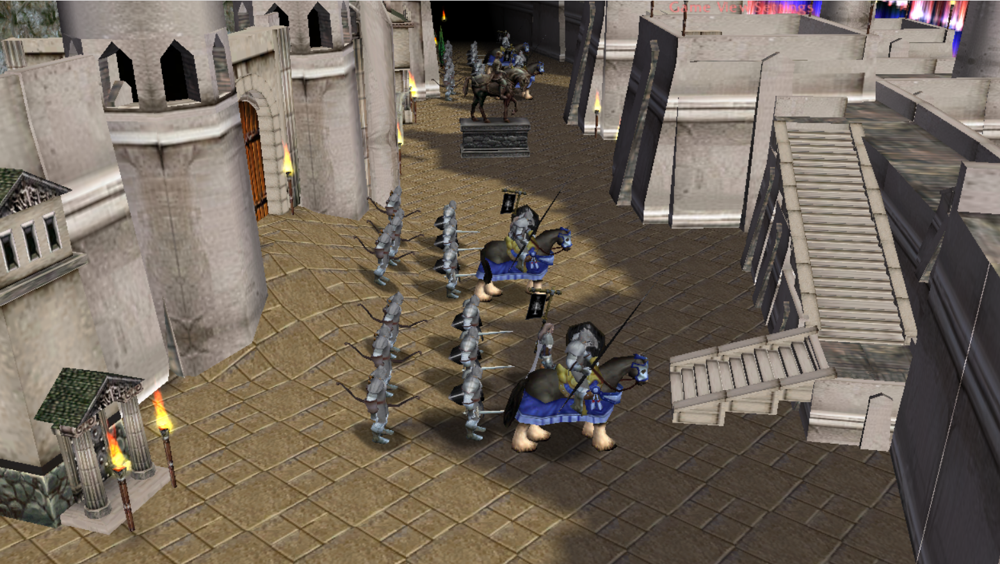
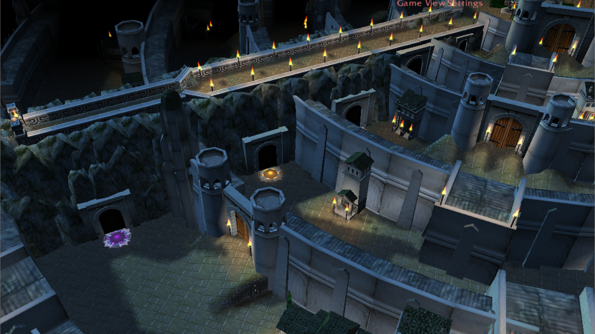

# The Siege of Minas Tirith

Warcraft III: Reforged defense funmap based on the movie The Lord of the Rings: The Return of the King.

## Play the Map

* [Discord Server](https://discord.gg/C83VG7WneW)
* [Download on Hive](https://www.hiveworkshop.com/threads/minas-tirith-0-2.311338/)
* [Download on Warcraft 3: Reforged - Map database](https://maps.w3reforged.com/maps/categories/castle-defense/the-siege-of-minas-tirith-06-642310)
* [0.6](./TheSiegeOfMinasTirith0.6.w3x)

The current version of the map is restricted to SD graphics to avoid performance issues and since it uses custom models anyway.

## Description

Two forces fight each other over the city Minas Tirith.
Minas Tirith must protect the White Tree at any cost until the Army of the Dead arrives.
Sauron's Forces have to destroy the White Tree before the Army of the Dead arrives and kills them all.

Every player can choose one hero from a number of characters from the Lord of the Ring movies.
Each hero can only be chosen once.
When the hero dies he/she is revived automatically.
You can repick your hero and he/she will keep the XP and items.

Every player has to train units which spawn automatically and cost only food.
Minas Tirith players can control Gates and Trebuchets to defend the city.
The gates of the city can be opened/closed by Gondor players.

Killing hostile units and heroes gives the players gold.
There is no automatic income.
Gold is only used for buying items and upgrading units.

The following events will happpen after a fixed time:

* Ride of the Rohirim and Haradrim arrive with Mumakil
* The Army of the Dead arrives

### Unit Training

The unit training happens automatically other than in Warcraft III: Reforged.
You just have to choose the unit types which are enabled.
Units will spawn automatically every X seconds.
The spawned units will automatically follow your rally point unit.

## Features

* Heroes, items, units, music, models, textures and icons from the Lord of the Rings movies.
* Automatic unit spawns with movable rally points.
* Only unit upgrades and hero items cost gold which is gained by unit kills.
* Gates which can be opened/closed by Gondor players.
* Trebuchets on towers with an automatic target flag which can be controlled by Gondor players
* Siege towers to enter the walls of the city.
* Multiboard with player stats and information.
* Automatic hero revivals.
* Unlimited hero repicks, keeping XP and items.
* Custom models, icons and textures fitting the movie.
* Mocks via chat commands with sound effects.
* Events from the movie with small video sequences.
* AI and automatic attacks for computer-controlled players.
* Automatic team balance when all players from a team leave the game.
* Torches during the night.
* Destroyable buildings in the city which drop items.
* Chat command to give players gold.
* Chat command to start a votekick.
* Small skippable video sequences.
* Auto balancing of the food limit depending on the number of playing players.

## Screenshots

|               |               |
| ------------- | ------------- |
|              |  |
|              |  |
|              |  |
|              |

## Videos

## Older Versions

* [0.1](./old/TheSiegeOfMinasTirith0.1.w3x)
* [0.2](./old/TheSiegeOfMinasTirith0.2.w3x)
* [0.3](./old/TheSiegeOfMinasTirith0.3.w3x)
* [0.4](./old/TheSiegeOfMinasTirith0.4.w3x)
* [0.5](./old/TheSiegeOfMinasTirith0.5.w3x)

## TODOs

See [issues](https://github.com/tdauth/the-siege-of-minas-tirith/issues).

## Credits

* Loading screen and music: Lord of the Rings - The Return of the King
* Denethor skin, Gondor banner: grunt - see: Lord of the Rings models for Minas Tirith
* Medieval Trebuchet - olofmoleman
* Gondor Soldier - Elenai
* Gondor Shieldbearer - Elenai
* NazgulRider - olofmoleman
* Gondorian Tower (Variation 1) - Fingolfin
* Gondorian Tower (Variation 2) - Fingolfin
* Gondorian Wall - Fingolfin
* Gondorian Roof - Fingolfin
* Gondorian House - Fingolfin
* Gondorian Wall 2 - Fingolfin
* Ruins of house - Mike
* Mumakil - HerrDave
* Siege Tower - Mike
* Wall Doors - Tranquil
* Wall Passages - Tranquil
* Walls - Tranquil
* Pillars - Tranquil
* Wall Windows - Tranquil
* Wall Passages 2 - Tranquil
* Wall Niches - Tranquil
* Nazgul - olofmoleman
* Gimli - Hueter
* Pregrin Took - Stanakin
* Lord of the Rings :: Rider of Rohan - CloudWolf
* BTNNazgulRider - olofmoleman
* BTNTrebuchet - olofmoleman
* BTNCWRohanRider - CloudWolf
* BTNGimli - deathknight2000
* BTNHeroNazgul - QuadraDowN
* BTNSiegetower - Eagle XI
* BTNFortifiedGate - Eagle XI
* Barracks - Mike
* Haradrim Pikeman VII (icon + model) - Uncle Fester
* HaradrimArcherVII (icon + model) - Uncle Fester
* (WotR) ARagorn - HerrDave
* Wheat Field - Fingolfin
* Huntsman (War of the Ring) - HerrDave
* Nazgul - HerrDave
* Nazgul Lord - HerrDave
* Fountain Guard - HerrDave
* Hero Glow - assasin_lord
* BTNsoldier - GhostThruster
* Legolas - HerrDave
* Ring of Power - RightField
* HaradrimWatchTower - Uncle Fester
* BTNHaradrimWatchtower - Uncle Fester
* HaradrimBannerCarrier - Uncle Fester
* BTNHaradrimBannerCarrier - Uncle Fester
* BTNHaradrimRider - Uncle Fester
* HaradrimRider - Uncle Fester
* BTNAxe - Raging Ent
* BTNDagger - UnholyDobry
* BTNMorgulBlade - Uncle Fester
* BTNBreadstick - Thorneon
* Legolas texture - Hueter
* BTNlegolasHD - GhostThruster
* Many lord of the Ring models and icons - https://vk.com/albums-67833009
* Umbar Black Ship - infrenus
* Umbar Black Ship icon - infrenus
* Uruk Hai Crossbowman - Fingolfin
* Uruk Hai Swordsman - Fingolfin
* Uruk Hai Pikeman - Fingolfin
* BTNUruk-haiPikeman - Alok
* BTNPalantirSauron - I3lackDeath
* Trololo sound - https://www.myinstants.com/instant/trololo/
* BTNDoombringer - Novart
* BTNMace - PrinceYaser
* BTNGateOpen - Mayday
* BTNGateClosed - Mayday
* BTNFlameSword - Jay the Editor
* ArrowVolley - Em!
* Haradrim Horn Sound - https://www.myinstants.com/instant/haradrim-horn-13713/
* Rohan Horn Sound - https://www.myinstants.com/instant/rohan-horn-43757/
* Cliff models and textures - Born2Modificate
* Lord of the Rings quote sound files - https://www.audiblebeauty.net/returnking.php
* BTNGrond - https://lotr.fandom.com/wiki/Grond?file=Grond_arrives.png
* BTNBalrog - https://upload.wikimedia.org/wikipedia/en/7/7f/Balrog500ppx.png
* BTNMouthOfSauron - https://static.wikia.nocookie.net/lotr/images/f/f2/Mouth_of_Sauron.png/revision/latest?cb=20210117030358
* BTNManOfRhun - HerrDave
* Easterling models - HerrDave
* Witch King on Fell Beast - DaveDave91
* BTNWitchKingOnFellBeast - DaveDave91
* Gimli model - Jhotam
* Replaceable banner - Illidan(Evil)X
* Gondor archeway door and other city doodads - HerrDave
* Gondor doors - Tranquil
* Gondor statues (Isildur, Anarion, regular), White Tree model, -  Valandil's Middle Earth Template map https://www.hiveworkshop.com/threads/middle-earth-template.315060/
* BTNSearingArrowsAlt - BETA
* Easterling models - Filius Dei
* Cider model - HerrDave
* BTNDrinkAle - Sin'dorei300
* BTNWine - kola
* Madril model - Author: AOTR team (https://www.moddb.com/mods/the-horse-lords-a-total-modification-for-bfme) Edited and adapted for wc3: GhostHeroine aka prizraknadache
* BTNMadril - https://static.wikia.nocookie.net/peter-jacksons-the-lord-of-the-rings-trilogy/images/9/99/Madril.jpg/revision/latest?cb=20151025074132
* BTNWell - communist_orc
* BTNAthelas - Palaslayer
* BTNDH_Courage_Aoura - CRAZYRUSSIAN
* BTNWatcher - https://static.wikia.nocookie.net/lotr/images/e/e6/Watcher1.jpg/revision/latest?cb=20110622155018
* Upscaled "Textures\CityStructures.blp" file - SpringBreak
* Force Shield(no colour) - ApeJI
* Force Shield(Team colour) - ApeJI
* WoodBig model - Ergius
* BTNWoodBig - Ergius
* Hammer - Hermit
* Gondor banner - https://upload.wikimedia.org/wikipedia/commons/2/2c/Escudo_Real_de_Gondor.svg
* Mordor banner - https://en.wikipedia.org/wiki/Mordor#/media/File:Flag_of_Mordor_SVG.svg
* Harad banner icon - https://en.wikipedia.org/wiki/Harad#/media/File:Flag_of_Harad.svg
* Rohan banner icon - https://upload.wikimedia.org/wikipedia/commons/4/43/Flag_of_the_Kingdom_of_Rohan_No_Border.svg
* BTNRandomBasicIcon - Jampacked11
* Mordor Horn sound - https://www.youtube.com/watch?v=sEClzllDVJo
* KnockBack System - Destroyer95, https://www.hiveworkshop.com/threads/knockback.151662/
* Teamcolored pulse Aura - Malvodion
* String functions (adapted) - maskedpoptart, https://www.hiveworkshop.com/threads/string-functions.133059/
* Survival Ministructure: Skinning Rack - The_Silent
* BTNSarumansStaff - https://www.julienslive.com/images/lot/1490/149006_0.jpg?1441931978
* BTNEasterlingsMarch - http://www.councilofelrond.com/wp-content/uploads/modules/My_eGallery/gallery/characters/other/e70asterlings/coetttrohirrim_easterlingsmarch.jpg
* Easterlings marching and horn sound - https://www.youtube.com/watch?v=5tMVP2JqvVI
* Easterlings banner - https://www.councilofelrond.com/albums/LHH_Decor/easterling_banner.jpg
* Animated Grond model - FeelsGoodMan, https://www.hiveworkshop.com/threads/place-units-on-invisible-platforms-with-fixed-z.331906/#post-3482256